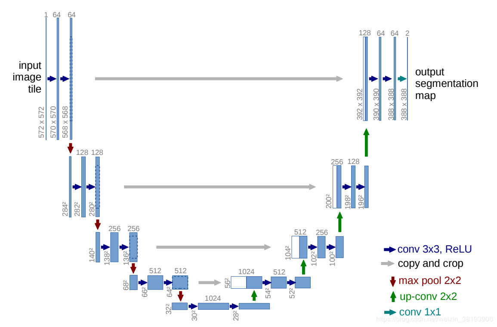
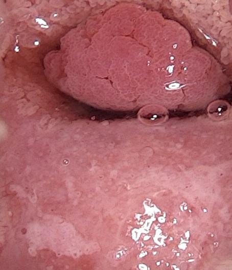
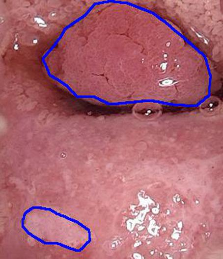
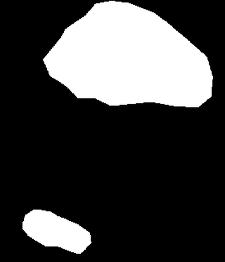
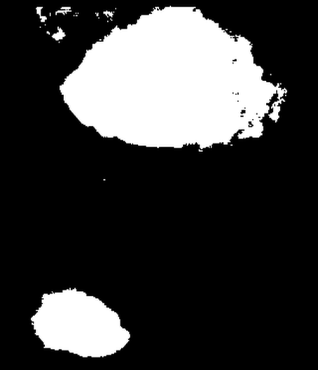
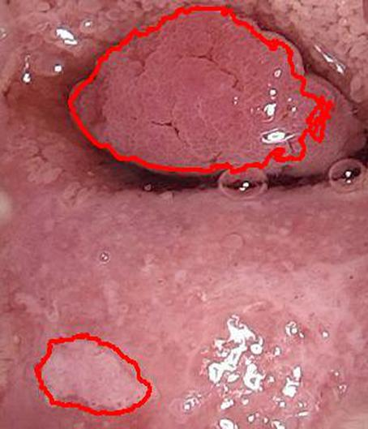
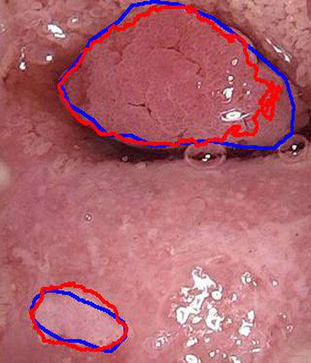

# UNet语义分割宫颈病变区域
#### 人工智能在医疗领域的应用越来越重要。在众多危害人体健康的疾病中，宫颈癌是最常见的妇科恶性肿瘤，宫颈癌的早期筛诊有利于预防疾病的发生和尽早采取治疗措施，从而保护病人健康。本项目运用UNet算法模型自动检测分割宫颈病变区域。

## 1 &nbsp;UNet网络结构
##### UNet网络先下采样，经过不同程度的卷积，学习深层次的特征，再经过上采样回复为原图大小，上采样用反卷积实现,最后输出类别数量的特征图。整个网络结构如同一个U型。
  

##### 具体的下采样、上采样网络结构如下代码。
	def get_unet(input_img, n_filters=16, dropout=0.5, batchnorm=True):
	    # contracting path
	    c1 = conv2d_block(input_img, n_filters=n_filters * 1, kernel_size=3, batchnorm=batchnorm)
	    p1 = MaxPooling2D((2, 2))(c1)
	    p1 = Dropout(dropout * 0.5)(p1)
	
	    c2 = conv2d_block(p1, n_filters=n_filters * 2, kernel_size=3, batchnorm=batchnorm)
	    p2 = MaxPooling2D((2, 2))(c2)
	    p2 = Dropout(dropout)(p2)
	
	    c3 = conv2d_block(p2, n_filters=n_filters * 4, kernel_size=3, batchnorm=batchnorm)
	    p3 = MaxPooling2D((2, 2))(c3)
	    p3 = Dropout(dropout)(p3)
	
	    c4 = conv2d_block(p3, n_filters=n_filters * 8, kernel_size=3, batchnorm=batchnorm)
	    p4 = MaxPooling2D(pool_size=(2, 2))(c4)
	    p4 = Dropout(dropout)(p4)
	
	    c5 = conv2d_block(p4, n_filters=n_filters * 16, kernel_size=3, batchnorm=batchnorm)
	
	    # expansive path
	    u6 = Conv2DTranspose(n_filters * 8, (3, 3), strides=(2, 2), padding='same')(c5)
	    u6 = concatenate([u6, c4])
	    u6 = Dropout(dropout)(u6)
	    c6 = conv2d_block(u6, n_filters=n_filters * 8, kernel_size=3, batchnorm=batchnorm)
	
	    u7 = Conv2DTranspose(n_filters * 4, (3, 3), strides=(2, 2), padding='same')(c6)
	    u7 = concatenate([u7, c3])
	    u7 = Dropout(dropout)(u7)
	    c7 = conv2d_block(u7, n_filters=n_filters * 4, kernel_size=3, batchnorm=batchnorm)
	
	    u8 = Conv2DTranspose(n_filters * 2, (3, 3), strides=(2, 2), padding='same')(c7)
	    u8 = concatenate([u8, c2])
	    u8 = Dropout(dropout)(u8)
	    c8 = conv2d_block(u8, n_filters=n_filters * 2, kernel_size=3, batchnorm=batchnorm)
	
	    u9 = Conv2DTranspose(n_filters * 1, (3, 3), strides=(2, 2), padding='same')(c8)
	    u9 = concatenate([u9, c1], axis=3)
	    u9 = Dropout(dropout)(u9)
	    c9 = conv2d_block(u9, n_filters=n_filters * 1, kernel_size=3, batchnorm=batchnorm)
	
	    outputs = Conv2D(1, (1, 1), activation='sigmoid')(c9)
	    model = Model(inputs=[input_img], outputs=[outputs])
	    return model

 

## 2 &nbsp;分割结果 
##### 1) 先用UNet网络提取宫颈部位。
宫颈部位如下图所示：  
原图      
  
对宫颈的病变区域进行标注,下图蓝色标记线内为病变区域：  

##### 2) 模型训练
把标注了病变区域的宫颈图片转成为二分类黑白掩码，原宫颈图片作为训练数据，掩码图作为标签，用上述UNet网络进行训练。
  

##### 3) 模型预测
模型训练得到权重参数，加载权重参数，就可对未标注病变区域的宫颈图片进行预测。为了更好的说明分割结果，还是以上面的宫颈图片为例。模型训练的时候，上面的宫颈图片不作为训练数据。对上面的宫颈图片进行预测分割，得到的预测掩码如下图：
 

根据掩码图，得到分割的轮廓线，在原宫颈图片中画出预测得到的病变区域如下图：
 
 
实际的病变区域和预测得到的病变区域对比如下，由图可见，模型基本上能正确预测宫颈的病变区域。      
  